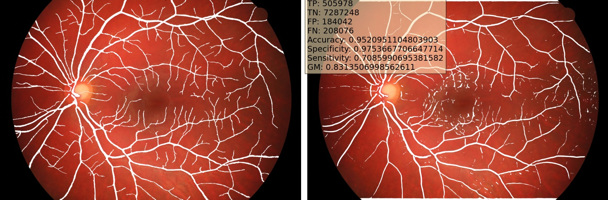
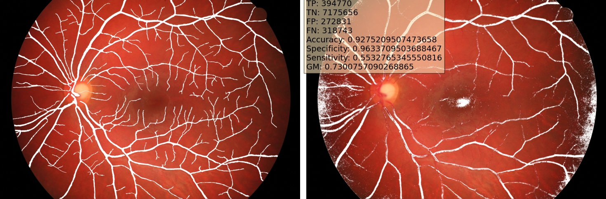
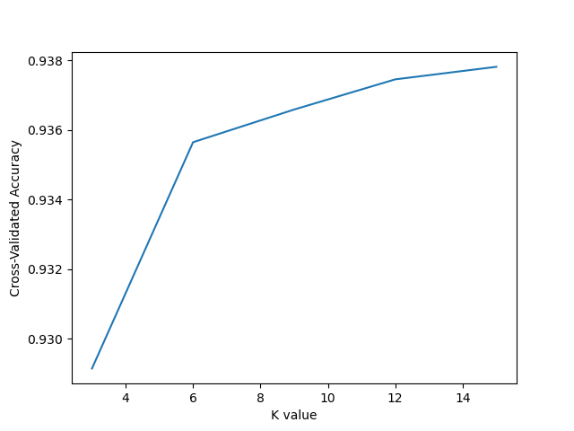

# Retinal Vessel Segmentation
### How it works (image processing):
1. Leave only green channel  
1. Gaussian blur 
1. CLAHE 
1. Frangi Edge detection 
1. Adaptive thresholding 
1. Binary erosion

#### Right - how it supposed to look, left - how it looks using aforementioned techniques:

### How it works (machine learning):
1. Leave only green channel  
1. Gaussian blur 
1. CLAHE
1. Randomly choose a number of pixels of each training image and
for each pixel A cut 5x5 px chunk where A is in its center
1. Calculate 7 Hu moments of each chunk and use it as feature vectors
1. Check the value of corresponding pixels from ground truth manually 
created images and use it as
class labels where 1 - vessel, 0 - background
1. Find the best k parameter value for KNN classifier using k-fold cross-validation

#### Right - how it supposed to look, left - how it looks using the aforementioned approach:

#### Tuning k value for KNN using k-fold cross-validation:

#### Where to download HRF images: https://www5.cs.fau.de/research/data/fundus-images/ 
